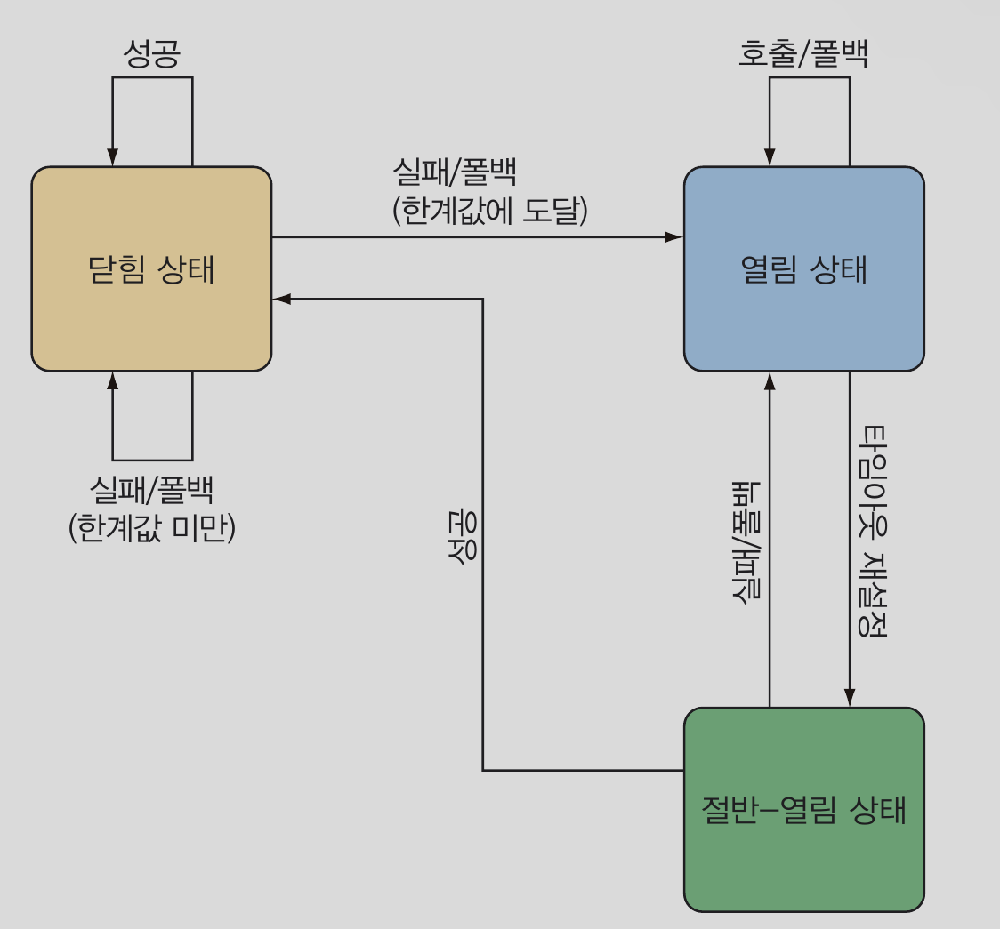
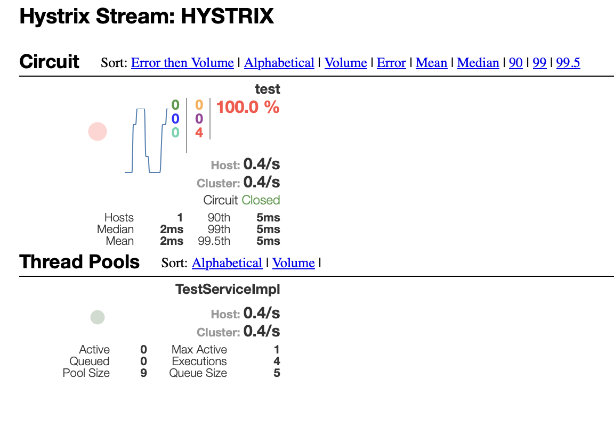

# 15.  실패와 지연 처리하기

## 15.1 서킷 브레이커란?
서킷브레이커 패턴은 우리가 작성한 코드가 실행에 실패하는 경우에 안전하게 처리되도록 해준다. 이 패턴은 마이크로서비스의 컨텍스트에 훨씬 더 중요하다. 한 마이크로서비스의 실패가 다른 마이크로
서비스의 연쇄적인 실패로 확산되는 것을 방지해야 하기 때문이다.

서킷브레이커 패턴의 발상은 비교적 간단하며, 서킷브레이커는 메소드의 호출을 허용하며, 서킷은 닫힘 상태에서 시작된다. 그리고 어떤 이유든 메소드 실행이 실패하면(
메소드 실행 횟수나 시간 등의 정의된 한곗값을 초과하면), 서킷 브레이커가 개방되고 실패한 메소드에 대해 더 이상 호출이 수행되지 않는다. 그러나 소프트웨어 서킷브레이커는
전기 회로 차단기와 다르게 fallBack을 제공하여 자체적으로 실패를 처리한다.



서킷브레이커로 보호되는 메소드가 실행에 성공하면 서킷은 닫힘상태가 유지되고, 이후에도 해당 메소드가 실행된다. 그러나 서킷 브레이커로 보호되는 메소드가 실행에 실패하면,
서킷은 열림 상태가 되고 이후에는 실패한 메소드 대신 폴백 메소드가 호출된다. 그러나가 때때로 서킷이 절반 열림 상태로 바뀌면서 실패했던 메소드의 호출을
서킷 브레이커가 다시 시도한다. 그러나 여전히 실패하면 서킷은 다시 열림 상태가 되고, 이후에는 다시 폴백 메소드가 호출된다. 하지만 성공하면 문제가 해결된 것으로
간주하여 서킷은 닫힘 상태가 된다. 

서킷 브레이커를 더 강력한 형태의 try/catch라고 생각하면 이해하는데 도움이 될 수 있다. 즉, 닫힘 상태는 try 블록과 유사한 반면, 폴백 메소드는 catch 블록과 
유사하다. 그러나 try/catch와 다르게 서킷 브레이커는 원래 호출하려던 메소드가 너무 자주 실패하면 폴백 메소드를 호출한다.

서킷 브레이커는 메소드에 적용된다. 따라서 하나의 마이크로서비스에 많은 서킷브레이커가 있을 수 있다. 그러므로 우리 코드 어디에 서킷브레이커를 선언할지 결정할 떄는
실패의 대상이 되는 메소드를 식별하는 것이 중요하다. 대개는 다음 유형의 메소드들이 서킷브레이커 대상 후보가 된다.

- REST를 호출하는 메소드 : 사용할 수 없거나 HTTP 500 응답을 반환하는 원격 서비스로 인해 실패할 수 있는 메소드이다.
- 데이터베이스 쿼리를 수행하는 메소드 : 어떤 이유든 DB가 무반응 상태가 되거나, 애플리케이션을 중단시킬 수 있는 스키마의 변경이 생기변 실패할 수 있는 메소드이다.
- 느리게 실행될 가능성이 있는 메소드 : 이것은 반드시 실패하는 메소드가 아니다. 그러나 너무 오랫동안 실행된다면 비정상 상태를 고려할 수 있다.

첫 번째, 두 번째는 서킷브레이커 실패 처리로 해결할 수 있다. 그러나 마지막 유형은 실패보다 지연이 문제되는 경우다. 이 경우에도 서킷 브레이커의 또 다른 장점을 살려서
도움을 줄 수 있다. 지연은 마이크로서비스 관점에서도 매우 중요하다. 지나치게 느린 메소드가 상위 서비스에 연쇄적 지연을 유발하여 마이크로 서비스의 성능을 저하하지 않게
하는 것이 중요하기 때문이다.

Netflix Hystrix는 서킷 브레이커 패턴을 자바로 구현한 라이브러리다. 간단히 말하면 Hystrix는 대상 메소드가 실패할 때 폴백 메소드를 호출하는 Aspect로 
구현된다. 그리고 서킷 브레이커 패턴을 제대로 구현하기 위해서 Aspect 대상 메소드가 얼마나 자주 실패하는지도 추적한다. 그 다음, 싶패율이 한계치를 초과하면 모든 대상 메소드
호출을 폴백 메소드 호출로 전달한다.

## 서킷 브레이커 선언하기
```xml
<dependency>
    <groupId>org.springframework.cloud</groupId>
    <artifactId>spring-cloud-starter-netflix-hystrix</artifactId>
</dependency>
```
Hystrix 의존성이 추가되었으므로 다음은 Hystrix를 활성화해야 한다. 이때는 각 애플리케이션 메인 구성 클래스에 ```@EnableHystrix``` 어노테이션을 지정하면 된다.
이렇게 활성화 후, 메소드에 ```@HystrixCommand``` 어노테이션으로 활성화하면 된다. 

Hystrix가 가장 진가를 발휘하는 시점은 처리되지 않은 unchecked 에외를 당면했을 때다. 특히 마이크로서비스의 경우가 그렇다. 장애가 생기면 마이크로서비스는 베가스 규칙을 적용해야 한다.
즉, 마이크로서비스에서 생긴 에러는 다른 곳에 전파하지 않고 마이크로 서비스에 남긴다는 얘기이다.

서킷 브레이커를 선언할 떄는 ```@HystixCommand```를 메소드에 지정하고 폴백 메소드를 제공한다. 
```java
@Service
public class TestServiceImpl implements TestService{
    @Override
    @HystrixCommand(fallbackMethod = "testDefault")
    public String test() {

        if(true){
            throw new NullPointerException();
        }

        return "TEST";
    }

    public String testDefault(){
        return "TestDefault";
    }
}
```
이렇게 되면 서킷브레이커가 실패로부터 보호하므로 test() 메소드의 안전 장치가 된다. 따라서 어떤 이유든 unchecked 예외가 발생하면
testDefault를 대신 실행시켜준다.

폴백 메소드는 우리가 원하는 어떤 것도 할 수 있지만, 원래 의도했던 메소드가 실행이 불가능할 때 대비하는 의도로 사용한다. 단, 폴백 메소드는 원래 메소드와
시그니쳐가 같아야한다. (이름만 다르다.) 따라서 매개변수가 없는 test()와 같이 testDefault() 역시 매개변수가 없어야 한다.

여기서 폴백 메소드도 서킷브레이커를 가질 수 있는지 궁금할 것이다. 일단 위의 예는 실패할 가능성이 없다. 그러나 만약 실패할 가능성이 생기면 잠재적인 장애점이 될 수 있다.
이 경우 폴백에 ```@HystrixCommand```를 지정하여 또 다른 폴백 메소드를 제공할 수 있다. 그리고 필요하면 많은 폴백 메소드를 연쇄적으로 지정할 수 있다.
단, 한 가지 제약이 있다. 폴백 스택의 마지막은 실패하지 않는, 서킷브레이커가 필요 없는 메소드가 있어야 한다.

## 15.2.1 지연 시간 줄이기
또한, 서킷 브레이커는 메소드의 실행이 끝나고 복귀하는 시간이 너무 오래 걸릴 경우 타임 아웃을 사용하여 지연 시간을 줄일 수 있다. 기본적으로 ```@HystrixCommand```
가 지정된 메소드는 1초 후에 타임아웃되고 이 메소드의 폴백이 호출된다.

1초의 타임아웃은 합리적인 기본값이며, 대부분의 경우에 적합하다. 그러나 Hystrix의 속성을 변경해서 타임아웃을 변경할 수 있다. ```@HystrixCommand```의
```commandProperties```로 명령 속성을 전달할 수 있다. commandProperties 속성은 설정될 속성의 이름과 값을 지정하는 하나 이상의  HystrixProperty
어노테이션을 저장한 배열이다.

서킷 브레이커의 타임 아웃을 변경하여면 ```execution.isolation.thread.timeoutInMilliseconds```를 설정해야한다.
```java
@HystrixCommand(fallbackMethod = "testDefault",
           commandProperties = {
                @HystrixProperty(name = "execution.isolation.thread.timeoutInMilliseconds", value = "500")
            }
        )
public void timeout() {
    //....
}
```

또는 ```execution.timeout.enabled```를 false로 지정해서 타임아웃을 없앨 수도 있다. 그러나 이렇게 설정하면 지연 시간이 보호되지 않는다. 이러한 이유로
연쇄 지연 효과(cascading latency effect)가 발생할 수도 있다.


## 15.2.2 서킷 브레이커 한계값 관리
만일 서킷 브레이커로 보호되는 메소드가 10초 동안에 20번 이상 호출되고 이 중 50% 이상이 실패한다면 기본적으로 이 서킷은 열림 상태가 된다. 또한, 이후 모든 호출은 폴백
메소드에 의해서 처리된다. 그리고 5초 후에 이 서킷은 절반-열림 상태가 되어 원래 메소드로 호출이 다시 시도된다.
Hystrix의 명령 속성을 설정하면 실패와 재시도 한계값을 변경할 수 있다. 서킷 브레이커의 상태 변화를 초래하는 조건에 영향을 주는 명령 속성은 아래와 같다.

- ```circuitBreaker.requestVolumeThreshold``` : 지정된 시간 내에 메소드가 호출되어야 하는 횟수 
- ```circuitBreaker.errorThreasholdPercentage``` : 지정된 시간 내에 실패한 메소드 호출의 비율
- ```metrics.rollingStats.timeInMilliSeconds``` : 요청 횟수와 에러 비율이 고려되는 시간 
- ```circuitBreaker.sleepWindowInMilliseconds``` : 절반-열림 상태로 진입하여 실패한 메소드가 다시 시도되기 전에 열림 상태의 서킷이 유지되는 시간

만일 ```metrics.rollingStats.timeInMilliSeconds```에 이정된 시간 이내에 ```circuitBreaker.requestVolumeThreshold```와 ```circuitBreaker.errorThreasholdPercentage```
모두가 초과된다면, 서킷은 열림 상태로 머무른다. 그리고 ```circuitBreaker.sleepWindowInMilliseconds```에 지정된 시간동안 열림 상태에 머무른다.
그다음에 절반-열림 상태가 되는 시점에 원래의 실패 메소드에 대한 호출이 다시 시도된다.
```java

@Override
@HystrixCommand(fallbackMethod = "testDefault", commandProperties = {
        @HystrixProperty(name = "circuitBreaker.requestVolumeThreshold", value="30"),
        @HystrixProperty(name = "circuitBreaker.errorThresholdPercentage", value = "25"),
        @HystrixProperty(name = "metrics.rollingStats.timeInMilliseconds", value = "20000")
    }
)
public String testHystrix() {
    if(true){
        throw new NullPointerException();
    }

    return "TEST";
}
```
메소드 실패와 지연을 처리하는 것 이외에 Hystrix는 애플리케이션에 있는 각 서킷 브레이커의 메트릭도 스트림으로 발행한다. 

## 15.3 실패 모니터링하기
서킷 브레이커로 보호되는 메소드 가 매번 호출될 때마다 해당 호출에 대한 여러 데이터가 수집되어 Hystrix 스트림으로 발행한다. 이는 애플리케이션의 건강 상태를 실시간으로
모니터링하는데 사용할 수 있다. 각 서킷 브레이커로부터 수집한 데이터 중에서 Hystrix 스트림은 다음을 포함한다.

- 메소드가 몇 번 호출되는지
- 성공적으로 몇 번 호출되는지
- 폴백 메소드가 몇 번 호출되는지
- 메소드가 몇 번 타임아웃되는지

이 Hystrix 스트림은 액츄에이터 엔드포인트로 제공된다. 
```xml
<dependency>
    <groupId>org.springframework.boot</groupId>
    <artifactId>spring-boot-starter-actuator</artifactId>
</dependency>
```
Hystrix 스트림 엔드포인트는 ```/actuator/hystrix.stream```경로로 노출시킬 수 있다.

애플리케이션이 시작되면 Hystrix 스트림이 노출된다. 따라서 어떤 REST 클라이언트를 사용해서 Hystrix 스트림을 소비할 수 있다.
하지만 커스텀 Hystrix 스트림 클라이언트의 작성을 시작하기 전에 알아 둘 것이 있다. Hystrix 스트림의 각 항목은 온갖 JSON 데이터로 가득
차있으므로 파싱하기 위해서 클라이언트 측 작업이 많이 필요하다. 이떄는 대시보드 사용을 고려할 수 있다.

## 15.3.1 Hystrix 대시보드 개요
Hystrix 대시보드를 사용하려면 
```xml
<dependency>
    <groupId>org.springframework.cloud</groupId>
    <artifactId>spring-cloud-starter-netflix-hystrix-dashboard</artifactId>
</dependency>
```
그 후 메인에 ```@EnableHystrixDashboard``` 어노테이션을 선언한다.
이후 {url}/hystrix로 접속하면 대시보드를 만나볼 수 있고 스트림할 타겟을 지정하면 스트림이 시작된다.
각 서킷브레이커는 다른 유용한 메트릭 데이터와 함께 그래프로 볼 수 있다. 

## 15.3.2 Hystrix 쓰레드 풀 이해하기
어떤 메소드가 자신의 일을 수행하는 데 너무 오랜 시간이 걸리는 경우를 생각해보자. 예를 들어 이 메소드가 다른 서비스에 HTTP 요청을 하고 있는데 해당 서비스 응답이 느려서
오래 걸린다고 해보자. 이 경우 해당 서비스가 응답할 때까지 Hystrix는 응답을 기다리면서 관련 쓰레드를 블로킹한다.

만일 그런 메소드가 호출자와 같은 쓰레드의 컨텍스트에서 실행 중이라면 호출자는 오래 실행되는 메소드로부터 벗어날 기회가 없다. 게다가 블로킹된 쓰레드가 제한된 수의
쓰레드 중 하나인데 지속적으로 문제가 생기면 사용 가능한 모든 쓰레드가 포화 상태가 되어 응답을 기다리게 된다.

이런 상황을 방지하기 위해서 Hystrix는 각 의존성 모듈의 쓰레드풀을 할당한다. 그리고 Hystrix 명령 메소드 중 하나가 호출될 때 이 메소드는 Hystrix가 관리하는 쓰레드 풀의
쓰레드에서 실행된다. 따라서 이 메소드가 너무 오래 걸린다면 호출 쓰레드는 해당 호출을 포기하고 벗어날 수 있으므로, 잠재적인 쓰레드 포화를 Hystrix가 관리하는 쓰레드 풀로 
한정할 수 있다.


ThreadPool 항목에서
- active: 황성 쓰레드 현재 개수
- queued: 현재 큐에 있는 쓰레드 개수 (기본적으로 비활성되어 있어서 0이다.)
- poolSize : 쓰레드 풀에 있는 개수
- maxActive: 샘플링 시간 동안 최대 활성 쓰레드 개수
- executors: Hystrix 명령 실행을 처리하기 위해 쓰레드 풀의 쓰레드가 호출된 개수
- queueSize: 쓰레드 풀 큐의 크기, 쓰레드 큐는 기본적으로 비활성되어 있으므로 이 값은 의미가 없다. 

쓰레드 풀의 대안으로 semaphore isolation의 사용을 고려해볼 만하다.

> 임계 구역(CriticalSection)
>  여러 프로세스 혹은 쓰레드가 작업을 수행하면서 공유된 자원을 건드리게 될 수 있는데, 이 때 프로그램 코드 상에서
> 공유 자원에 접근하는 부분을 임계구역이라고 한다.
>
> 
> 
>Semaphore, Mutex
> ToiletProblem
> 동시성 프로그래밍에서 '공유 자원관리'는 큰 이슈, 공유자원을 안전하게 관리하려면 상호 배제(Mutual Exclusion)이 중요
> Semaphore, Mutex는 이를 위해 고안된 기법
> 
> Mutex
> 뮤텍스는 화장실이 하나 밖에 없는 식당이다. 카운터에 키가 있으면 갈 수 있고 없다면 갈 수 없다.
> 누가 사용 중이라면 사용이 끝날 때까지 기다린다.
> 즉, 공유 자원 사용을 기다린 후, 다음 쓰레드가 해당 공유 자원을 사용하는 식으로 이뤄진다.
> 여기서 키는 공유 자원에 접근하기 위한 어떤 오브젝트이다. 이 오브젝트를 소유한 쓰레드/ 프로세스만 공유자원에 접근할 수 있다.
> 
> / 임계 구역을 가진 쓰레드들이 실행 시간이 겹치지 않고 단독으로 실행
> / Key에 해당하는 객체를 기반으로 접근
> / 다중 프로세스들의 공유 리소스에 대한 접근을 조율하기 위해서 동기화/ 락을 사용 (JAVA??)
> / 뮤텍스 객체를 다중으로 동시에 사용 불가
> 
> 
> Semaphore
> 세마포어는 여러 개의 칸이 있는 화장실이다. 화장실 입구에는 빈 칸의 개수를 보여준다.
> 즉, 사용하면 그 수만큼 차감되고 반환하면 증가한다. 빈 칸이 0이면 최소 1로 바뀔 때까지 대기한다.
> 
> / 공유 자원의 상태로 나타낼 수 있는 카운터로 생각할 때
>  - 사용하고 있는 쓰레드/프로세스 수를 공통으로 관리하는 하나의 값을 이용해서 상호배제 달성
>  - 운영체제 또는 커널의 한 지정된 저장장치 내의 값
>  - 일반적으로 비교적 긴 시간을 확보하는 리소스에 대한 이용
>  - 유닉스에서 세마포어는 운영체제 리소스를 경쟁적으로 사용하는 다중 프로세스에서 해동, 동기화 기술
> / 공유 자원에 접근할 수 있는 프로세스의 최대 허용치만큼 동시에 사용자 접근 가능
> / 각 프로세스는 세마포어의 값을 확인하고 변경할 수 있음
> / 자원을 사용하지 않는 상태가 될 때 대기하던 프로세스가 즉시 자원 사용
> / 이미 다른 프로세스에 의해 사용중이라는 사실을 알게되면 재시도 전에 일정 시간 대기해야 함
> / 세마포어는 이진수를 사용하거나 추가적인 값을 사용할 수 있다.
> 
> 정리하면 Mutex는 한 쓰레드, 프로세스에 의해 소유될 수 있는 Key를 기반으로 한 상호배제기법
> Semaphore는 signaling mechanism. 현재 공유 자원에 접근할 수 있는 프로세스, 쓰레드 수를 나타내는 값을 두어
> 상호 배제를 달성한다. 
> 
> 둘 다 완벽하지 않아서 데이터 무결성을 보장할 수 없으며, 데드락이 생길 수도 있다.
> 
> 
> Mutex vs. Semaphore
> 1. 동기화 개수 : Mutex = 동기화 대상이 오직 하나, Semaphore = 동기화 대상이 하나 이상
> 2. Semaphore는 Mutex가 될 수 있지만 Mutex는 Semaphore가 될 수 없다.
> 3. Mutex는 자원 소유 가능 + 책임을 가지는 반면 Semaphore는 자원 소유 불가능
> 4. Mutex는 소유하고 있는 쓰레드만이 Mutex를 해제할 수 있지만 Semaphore는 Semaphore를 소유하지 않는 쓰레드가 Semaphore를 해제할 수 있음
> 5. Semaphore는 시스템 범위에 걸쳐 있고 파일 시스템 상의 파일로 존재한다. 반면, Mutex는 프로세스의 범위를 가지며 프로세스 종료시 자동 clean up 된다.
> 
> [출처 : https://worthpreading.tistory.com/90]
> [출처 : https://velog.io/@heetaeheo/뮤텍스Mutex와-세마포어Semaphore의-차이]
> 

 ## 15.4 다수의 Hystrix 스트림 종합
Hystrix 대시보드는 한 번에 하나만 모니터링할 수 있다. 그래서 Turbine이 모든 마이크로서비스로부터 모든 Hystrix 스트림을 종합하는 방법을 제공한다.
스프링 클라우드 Netflix는 다른 스프링 클라우드 서비스 생성과 유사한 방법을 사용해서 Turbine 서비스의 생성을 지원한다. Turbine 서비스를 생성하려면 
Turbine 스타터 의존성을 빌드에 포함시켜야 한다.

```xml
<dependency>
    <groupId>org.springframework.cloud</groupId>
    <artifactId>spring-cloud-starter-netflix-turbine</artifactId>
</dependency>
```

```java
@SpringBootApplication
@EnableTurbine
public class TurbineApplication {

	public static void main(String[] args) {
		SpringApplication.run(TurbineApplication.class, args);
	}

}
```
이러면 다수의 마이크로서비스로부터 Hystrix 스트림이 소비되면 서킷 브레이커 메트릭들이 Turbine에 의해 하나의 Hystrix 스트림으로 종합된다. 
Turbine은 유레카 클라이언크로 작동하므로 Hystrix 스트림을 종합할 서비스들을 유레카에서 찾는다. 그러나 유레카에 등록된 모든 서비스의 Hystrix 스트림을 종합하지는 않는다.
따라서 Hystrix 스트림을 종합할 서비스들을 알 수 있게 Turbine을 구성해야한다. 이때 ```turbine.app-config``` 속성을 설정한다.

```turbine.app-config``` 속성에는 Hystrix 스트림을 종합하기 위해 유레카에서 찾을 서비스 이름들을 설정한다.

```yaml
server:
  port: 7979
turbine:
  app-config: "test-service","test"....
  cluster-name-expression: "default"
```
app-config에 종합할 서비스를 등록하며, cluster-name-expression도 default로 놓는다. 이는 이름이 default인 클러스터에 있는 모든 종합될 스트림을 Turbine이 수집해야한다는 것을 나타낸다. 
클러스터 이름을 설정하지 않으면 지정된 애플리케이션들로부터 종합될 어떤 스트림 데이터도 Turbine 스트림에 포함되지 않는다.
< 이해할 수 없는 내용 >

http://localhost:7979/turbine.stream을 Hystrix 대시보드 홈페이지에 입력하면 지정된 모든 애플리케이션의 서킷 브레이커가 대시보드에 출력된다.


## 요약
- 서킷브레이커 패턴은 유연한 실패 처리를 할 수 있다. 
- Hystrix는 매소드 실행에 실패하거나 타임아웃이 발생할 때 폴백 처리를 활성화하는 서킷 브레이커 패턴을 구현한다.
- Hystrix가 제공하는 각 서킷 브레이커는 애플리케이션의 건강 상태를 모니터링할 목적으로 Hystrix 스트림의 매트릭을 발행한다. 
- 이 스트림은 Hystrix 대시보드로 소비할 수 있으며, Turbine으로 하나 이상의 Hystrix 스트림을 종합하여 대시보드에서 볼 수 있다.